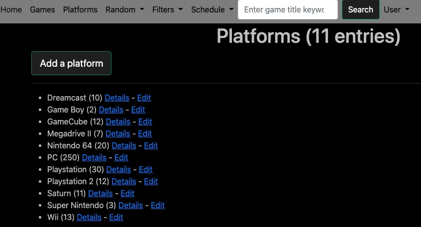
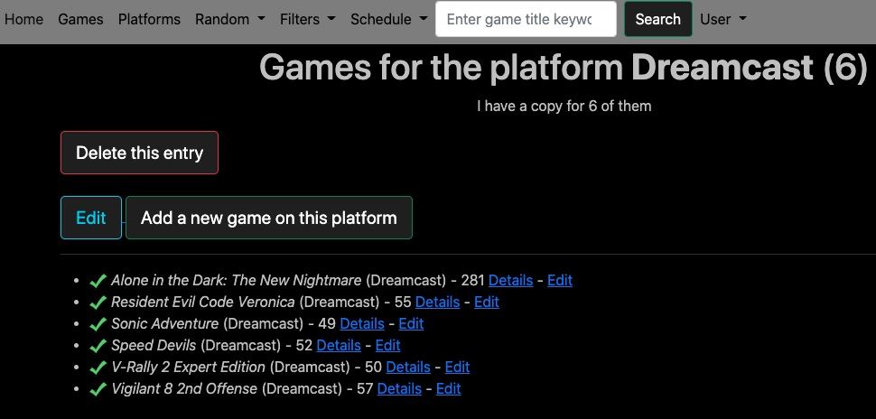

# GMG-FRONT (Give Me a Game, Front App)
   

A front-end implementation for the project [GMG](https://github.com/ecourtial/gmg). It covers most of the features.

## Installation
* Upload the code on your server.
* Copy the _.env_ file to a _.env.local_ one and fill it with your values.
* Run the _composer install_ command.

## Adding extra features
* If you want to add extra features, just open an issue here in this repo.

## Stack
* PHP 8.3
* Symfony 7.1
* Bootstrap 3

## Licence
Provided under the MIT licence.

## Screenshots

## Roadmap
* Add a filter to see all the games/copies/versions that have comments.

## Changelog

### v1.7.0
* Add the note feature to follow the 4.4.0 release of the back-end.
* Bump to Symfony 6.4 and PHP 8.3.

### v1.6.1
* Fix the display of the multiline comments on games, versions and copies.
* Updates Symfony to 6.3.

### v1.6.0
* Follow the 4.3.0 release of the back-end.
* Add support for return to new line in comments sections.
* Removed dead code.
* Updated the big box filter.

### v1.5.0
* Added another chart on the homepage: the same than the first one but not including games on compilations.
* Update Symfony components.

### v1.4.0
* Update to follow the 4.2 release of the back (add new support types and add a region field to copies).
* Update Symfony from 6.2.1 to 6.2.7.
* Added a chart on the homepage.

### v1.3.0
* Updated installation doc.
* We display on the homepage the count of versions for which we have at least one original copy.
* In the version list, there is a link to go to the related game.
* In the copy list, there is a link to go to the related version.
* You can now select the research type: version or games.
* Added a "Remember me" feature when logging-in.
* Jumped from Symfony 6.0 to 6.2.
* Updated Twig to remove a CVE.

### v1.2.1
* Fixed a bug when counting the versions in the todo list.

### v1.2.0
* Added a separation for ranking sequences (1-10, 11-20...) in the todo list.
* The API error message shows the URL that was requested.

### v1.1.0 : 
* Follow the 4.1 version of the back (support of ROM copy type and Plastic tube casing type).
* In the stories screen, instead of showing the story id, we show the story position.
