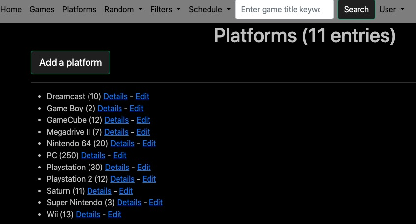
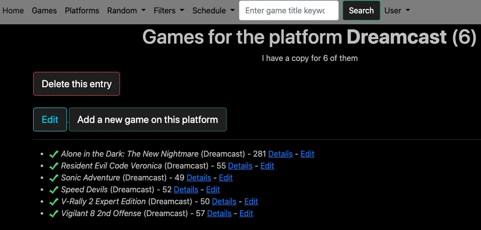

# GMG-FRONT (Give Me a Game, Front App)
   

A front-end implementation for the project [GMG](https://github.com/ecourtial/gmg). It covers most of the features.

## Installation

### Local environment (Docker)
* At the root of the folder, copy the _.env.dist_ file to a _.env_ one. Update it to your needs.
* Run _make start_.
* In the .env.dev file, add the Google reCaptcha keys. You can also change the backend URL here (see the _.env_ file).

### In production
* Upload the code on your server.
* Copy the _.env_ file to a _.env.local_ one and fill it with your values.
* Run the _composer install_ command.
* Add the Google reCaptcha keys.

## Adding extra features
* If you want to add extra features, just open an issue here in this repo.

## Stack
* PHP >=8.4
* Symfony 8.0
* Bootstrap 5

## Licence
Provided under the MIT licence.

## Screenshots

## Versions
* Version 1.x: compatible with v4 and v5 of the backend (but without the support of the latest features).
* Version 2.x: compatible with v5 of the backend.

## Changelog

See [here](CHANGELOG.md).